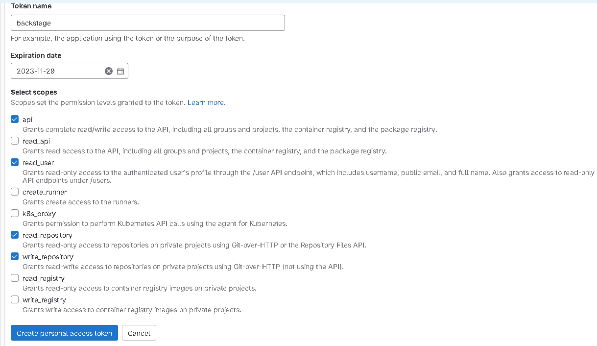

[](https://github.com/marcossilvestrini/learning-backstage/actions/workflows/eslint.yml)

[](https://github.com/marcossilvestrini/learning-backstage/actions/workflows/njsscan.yml)

[](https://github.com/marcossilvestrini/learning-backstage/actions/workflows/pages/pages-build-deployment)

[](https://github.com/marcossilvestrini/learning-backstage/actions/workflows/powershell.yml)

[](https://github.com/marcossilvestrini/learning-backstage/actions/workflows/github-code-scanning/codeql)

# Learning Backstage

## Get Started

- [Getting Started](https://backstage.io/docs/getting-started/)
- [Spotify Tutorial](https://backstage.spotify.com/blog/introducing-backstage-learn)


## Configure Postgresql

## Install plugins

```sh
# From your Backstage root directory
yarn add --cwd packages/backend pg
```

### Set your .env variables

```sh
export POSTGRES_HOST=localhost
export POSTGRES_PORT=5432
export POSTGRES_USER=postgres
export POSTGRES_PASSWORD=backstage
```

### Set app-config.yaml

```yaml
backend:
  database:
    client: pg
    connection:
      host: ${POSTGRES_HOST}
      port: ${POSTGRES_PORT}
      user: ${POSTGRES_USER}
      password: ${POSTGRES_PASSWORD}
          pluginDivisionMode: schema
    plugin:
      catalog:
        connection:
          database: backstage_db
      auth:
        connection:
          database: backstage_db
      app:
        connection:
          database: backstage_db
      scaffolder:
        connection:
          database: backstage_db
```

## Configure Auth

### Github

#### Create github Application


If you use nginx proxy, this is example:

<http://backstage.skynet.com.br>

<http://backstage.skynet.com.br/api/auth/github/handler/frame>

Enable device flow option

#### Configure frontend

*packages\app\src\App.tsx*

```ts
import { githubAuthApiRef } from '@backstage/core-plugin-api';
import { SignInPage } from '@backstage/core-components';

...
const app = createApp({
  apis,
  components: {
    SignInPage: props => (
      <SignInPage
        {...props}
        providers={[
          'guest',
          {
            id: 'github-auth-provider',
            title: 'GitHub',
            message: 'Sign in using GitHub',
            apiRef: githubAuthApiRef,
          },          
        ]}
      />
    ),
  },
```

#### Configure app

```yaml
...
enableExperimentalRedirectFlow: true
auth:
  # see https://backstage.io/docs/auth/ to learn about auth providers  
  environment: development  
  providers:    
    github:      
      development:
        clientId: ${AUTH_GITHUB_CLIENT_ID}
        clientSecret: ${AUTH_GITHUB_CLIENT_SECRET}  
```

#### Configure .env with github secret

```env
export AUTH_GITHUB_CLIENT_ID="fobarbeer"
export AUTH_GITHUB_CLIENT_SECRET="foobarbeer"
```

#### Test github callback

```html
http://backstage.skynet.com.br:7007/api/auth/github/start?env=development
```

### Gitlab

#### Create gitlab Application


If you use nginx proxy, this is example:

<http://backstage.skynet.com.br/api/auth/github/handler/frame>

#### Configure frontend

*packages\app\src\App.tsx*

```ts
import { gitlabAuthApiRef } from '@backstage/core-plugin-api';
import { SignInPage } from '@backstage/core-components';

...
const app = createApp({
  apis,
  components: {
    SignInPage: props => (
      <SignInPage
        {...props}
        providers={[
          'guest',
          {
            id: 'gitlab-auth-provider',
            title: 'Gitlab',
            message: 'Sign in using Gitlab',
            apiRef: gitlabAuthApiRef,
          },          
        ]}
      />
    ),
  },
```

#### Configure backend

*packages\backend\src\plugins\auth.ts*

```ts
...
providerFactories: {
      ...defaultAuthProviderFactories,     
      gitlab: providers.gitlab.create({
        signIn: {
          resolver(_, ctx) {
            const userRef = 'user:default/guest'; // Must be a full entity reference
            return ctx.issueToken({
              claims: {
                sub: userRef, // The user's own identity
                ent: [userRef], // A list of identities that the user claims ownership through
              },
            });
          },
          // resolver: providers.github.resolvers.usernameMatchingUserEntityName(),
        },
      }),     
    },
```

#### Configure app

*app.config.yaml*

```yaml
...
enableExperimentalRedirectFlow: true
auth:
  # see https://backstage.io/docs/auth/ to learn about auth providers  
  environment: development  
  providers:
    gitlab:      
      development:
        clientId: ${AUTH_GITLAB_CLIENT_ID}
        clientSecret: ${AUTH_GITLAB_CLIENT_SECRET}
        ## uncomment if using a custom redirect URI      
        callbackUrl: http://backstage.skynet.com.br/api/auth/gitlab/handler/frame
        ## uncomment if using self-hosted GitLab
        # audience: https://gitlab.company.com
        # audience : https://gitlab.com        
```

#### Configure .env with gitlab secrets

```env
export GITLAB_BASE_URL=https://gitlab.com
export AUTH_GITLAB_CLIENT_ID=foobarbeer
export AUTH_GITLAB_CLIENT_SECRET=foobarbeer
```

#### Test gitlab callback

```html
http://backstage.skynet.com.br:7007/api/auth/gitlab/start?env=development
```

## Configure gitlab Integration

### Create gitlab token



### Install gitlab plugins

From your Backstage root directory:

```sh
#yarn clean cache
yarn --cwd packages/app add @immobiliarelabs/backstage-plugin-gitlab
yarn --cwd packages/backend add @immobiliarelabs/backstage-plugin-gitlab-backend
#yarn install
```

### Add a new GitLab tab to the entity page

*packages/app/src/components/catalog/EntityPage.tsx*

```ts
import {
    isGitlabAvailable,
    EntityGitlabContent,
    EntityGitlabLanguageCard,
    EntityGitlabMergeRequestsTable,
    EntityGitlabMergeRequestStatsCard,
    EntityGitlabPeopleCard,
    EntityGitlabPipelinesTable,
    EntityGitlabReadmeCard,
    EntityGitlabReleasesCard,
} from '@immobiliarelabs/backstage-plugin-gitlab';

// Farther down at the serviceEntityPage declaration
const serviceEntityPage = (
    <EntityLayout>
      //...
      <EntityLayout.Route if={isGitlabAvailable} path="/gitlab" title="Gitlab">
        <EntityGitlabContent />
      </EntityLayout.Route>
      //...     
    </EntityLayout>
);

const overviewContent = (
    <Grid container spacing={3} alignItems="stretch">
      <EntitySwitch>
        <EntitySwitch.Case if={isGitlabAvailable}>
          <Grid item md={12}>
            <EntityGitlabReadmeCard />
          </Grid>
          <Grid item sm={12} md={3} lg={3}>
            <EntityGitlabPeopleCard />
          </Grid>
          <Grid item sm={12} md={3} lg={3}>
            <EntityGitlabLanguageCard />
          </Grid>
          <Grid item sm={12} md={3} lg={3}>
            <EntityGitlabMergeRequestStatsCard />
          </Grid>
          <Grid item sm={12} md={3} lg={3}>
            <EntityGitlabReleasesCard />
          </Grid>
          <Grid item md={12}>
            <EntityGitlabPipelinesTable />
          </Grid>
          <Grid item md={12}>
            <EntityGitlabMergeRequestsTable />
          </Grid>
        </EntitySwitch.Case>
      </EntitySwitch>
    </Grid>
);
```

### Add the integration for gitlab

*app-config.yaml*

```yaml
integrations:
    gitlab:
        - host: gitlab.com
          token: ${GITLAB_TOKEN}
```

### Add the GitLab Filler Processor

This allows auto-filling of the annotations like the project id and slug

*packages/backend/src/plugins/catalog.ts*

```ts
import { GitlabFillerProcessor } from '@immobiliarelabs/backstage-plugin-gitlab-backend';

export default async function createPlugin(
    env: PluginEnvironment
): Promise<Router> {
    const builder = await CatalogBuilder.create(env);
    //...
    // Add this line
    builder.addProcessor(new GitlabFillerProcessor(env.config));
    //...
    const { processingEngine, router } = await builder.build();
    await processingEngine.start();
    return router;
}
```

### Add the gitlab route 

*packages/backend/src/plugins/gitlab.ts*

```ts
import { PluginEnvironment } from '../types';
import { Router } from 'express-serve-static-core';
import { createRouter } from '@immobiliarelabs/backstage-plugin-gitlab-backend';

export default async function createPlugin(
    env: PluginEnvironment
): Promise<Router> {
    return createRouter({
        logger: env.logger,
        config: env.config,
    });
}
```

*packages/backend/src/index.ts*

```ts
import gitlab from './plugins/gitlab';

async function main() {
    //...
    const gitlabEnv = useHotMemoize(module, () => createEnv('gitlab'));
    //...
    apiRouter.use('/gitlab', await gitlab(gitlabEnv));
    //...
}
```

## Build Docker Image

### Build Local

```sh
DOCKER_USERNAME=skynet
DOCKER_PASSWORD=sarah_conor
yarn install --frozen-lockfile
yarn tsc
yarn build:backend --config ../../app-config.yaml
echo "$DOCKER_PASSWORD" | docker login -u "$DOCKER_USERNAME" 
docker image build . -f packages/backend/Dockerfile --tag backstage:latest
docker tag backstage:latest $DOCKER_USERNAME/backstage:latest
docker push $DOCKER_USERNAME/backstage:latest
```

### Build With Gitlab CI

```yaml
image: node:18

stages:
  - build
  - docker-build-and-push

cache:
  paths:
    - node_modules/

before_script:
  - yarn install --frozen-lockfile

build_backstage:
  stage: build
  script:
    - yarn tsc
    - yarn build:backend --config ../../app-config.yaml
  artifacts:
    paths:
      - packages/backend/dist/
  rules:
    - if: '$CI_PIPELINE_SOURCE == "push"'
      when: always
    - when: manual

docker_build_and_push:
  image: docker:20.10.8
  services:
    - docker:dind
  stage: docker-build-and-push
  before_script:
    - echo "$DOCKER_PASSWORD" | docker login -u "$DOCKER_USERNAME" --password-stdin
  script:
    - docker image build . -f packages/backend/Dockerfile --tag backstage:latest
    - docker tag backstage:latest $DOCKER_USERNAME/backstage:latest
    - docker push $DOCKER_USERNAME/backstage:latest
  rules:
    - if: '$CI_PIPELINE_SOURCE == "push"'
      when: always
    - when: manual
```

### Pull image

```sh
docker login
docker pull mrsilvestrini/backstage
```

## Test Docker IMage

```sh
docker run -it -p 7007:7007 backstage
```

## Access Backstage remotely

```ssh
# Create ssh tunel
ssh -L 3000:localhost:3000 -L 7007:localhost:7007 vagrant@192.168.0.150
# Access in browser
http://localhost:3000
```

## References

### Documentation

- [Official Documentation](https://backstage.io/docs/overview/what-is-backstage>)
- [Demo Auth providers](https://github.com/RoadieHQ/backstage-auth-example/blob/main/README.md)

### Backstage Default Icons

https://github.com/backstage/backstage/blob/master/packages/app-defaults/src/defaults/icons.tsx